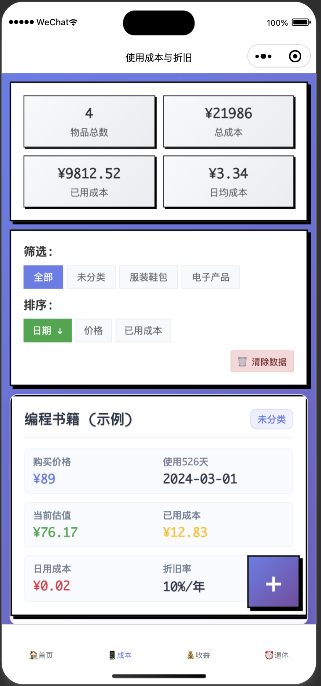
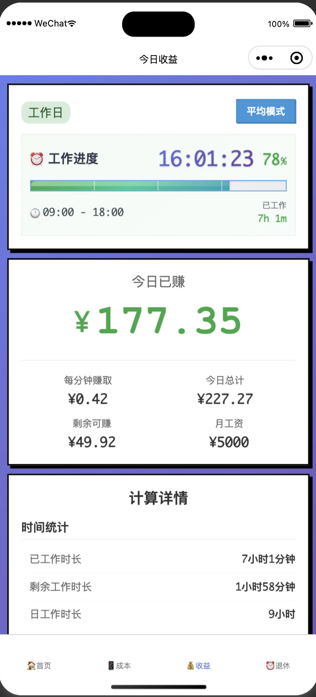
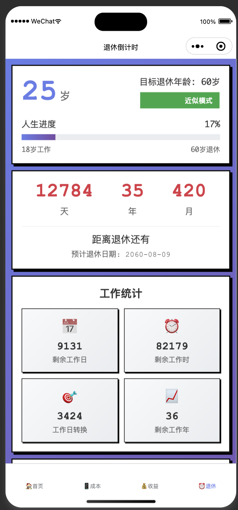

# 砖了么 - 微信小程序

"砖了么" 是一个帮助你量化日常开销与工作价值感的微信小程序，包含三大功能：

- **使用成本与折旧**：记录物品购买信息，按年折旧率（默认 20%）折算到天，或手动输入当前价格，计算已用成本、日用成本等。
- **今日收益**：按月工资与工作时段估算"每一刻在赚多少钱"，实时刷新今天已赚与剩余可赚。
- **退休倒计时**：根据目标退休年龄估算退休日期，并近似计算剩余需上班的天数与小时数。

## 🚀 运行方式

1. 安装并打开微信开发者工具。
2. 选择"导入项目"，项目目录选择本仓库根目录；配置文件已设置 `miniprogramRoot: miniprogram/`。
3. 如无真实 `appid`，可使用测试号或创建新的小程序项目。`project.config.json` 默认 `appid` 为 `touristappid`。

## 📁 目录结构

```
.
├── project.config.json          # 小程序配置文件
├── README.md                    # 项目说明文档
└── miniprogram/                 # 小程序源码目录
    ├── app.js                   # 小程序入口文件
    ├── app.json                 # 全局配置文件
    ├── app.wxss                 # 全局样式文件
    ├── sitemap.json            # 站点地图配置
    ├── utils/                   # 工具函数目录
    │   ├── calc.js             # 计算逻辑工具函数
    │   └── holiday_api.js      # 节假日API工具函数
    ├── components/             # 自定义组件目录
    │   └── odometer/           # 里程表数字滚动组件
    │       ├── index.js
    │       ├── index.json
    │       ├── index.wxml
    │       └── index.wxss
    └── pages/                  # 页面目录
        ├── index/              # 首页 - 总览和设置
        ├── depreciation/       # 使用成本与折旧页面
        ├── income/             # 今日收益页面
        ├── retirement/         # 退休倒计时页面
        └── holiday/            # 节假日日历页面
```

## ✨ 功能说明与公式

### 1) 使用成本与折旧

- **直线折旧（默认）**：按年折旧率 r（默认 20%）线性减少，日折旧额为 `price * r / 365`，当前估值 `max(price - dailyDep * usedDays, 0)`。
- **自定义当前价格**：若用户输入"当前价格"，则以此为准估算使用成本。
- **使用成本**：已用成本 `= price - currentValue`；日用成本 `= 已用成本 / usedDays`。

*说明：20%/年为线性折旧的近似，达到 5 年趋近于 0。你也可以切换为指数折旧（可在 `utils/calc.js` 中扩展）。*

### 2) 今日收益

- **平均模式**：`incomePerSecond = monthlySalary / (workDaysPerMonth * workSecondsPerDay)`。
- **精确模式**：当月逐日枚举，按"工作日掩码 + 节假日(排除) + 调休(强制工作日)"累计本月工作秒数，进行分摊。
- **实时计算**：当天若为工作日且在上班时段内累计，封顶为当日总额。
- **参数**：月工资、上/下班时间、月工作日、工作日掩码(1-7)、节假日、调休。

### 3) 退休倒计时

- **退休日期**：基于生日 + 退休年龄精确到日（无生日则按当前年龄近似）。
- **近似模式**：按 `workdaysPerWeek/7` 比例估算剩余上班天数。
- **精确模式**：逐日从明天起累加至退休日，结合工作日掩码/节假日/调休计算需上班天数，再乘以日工时得小时数。

## 💾 本地存储

- **物品记录**：存储在 `wx` 本地存储 key: `zl_items`。
- **配置信息**：工资、工时偏好等存储在 key: `zl_prefs`。

## 🎨 主题与像素风样式

- 在首页"偏好设置"可选择主题：`default` 或 `pixel`。
- 选择 `pixel` 后可进一步选择配色：`mint`、`sunset`、`grape`。
- 所有页面根容器会带上主题类，如：`theme-pixel theme-pixel-mint`，以统一像素风卡片/按钮/输入/进度条风格。

### 🎬 动效配置

- **开启收益动效**：控制"今日已赚"是否每秒动一次
- **动效样式**：`pulse`、`glow`、`shake`、`blink`、`odometer`
- **强度**：0-1，影响位移/缩放幅度
- **时长(ms)**：每次动画的持续时间

#### 里程表组件（odometer）

- 当动效样式选择 `odometer` 时，"今日已赚"将使用自研的数位滚动组件展示。
- 组件：`components/odometer`，可配置位数、宽高、小数位、过渡时长。

## 📅 节假日自动填充

- **节假日日历页面**：按年/月从线上接口拉取中国节假日与调休（优先 Timor，备选 Nager），可一键"应用到偏好"。
- **自动参与计算**：应用后将自动参与"今日收益精确模式"与"退休倒计时精确模式"的计算。

## 🔧 扩展建议

- 自定义折旧模型（指数/残值率/耐用上限天数）。
- 物品多币种支持与汇率（可本地设置固定汇率）。
- 上下班打卡自动化（基于地理围栏/手动快捷按钮）。
- 数据导出（CSV/图片海报）。
- 历史数据统计和图表展示。

## 📄 许可

MIT License

---

> 💡 **提示**：这是一个完整的微信小程序项目，包含了所有必要的功能模块和美观的UI界面。可以直接在微信开发者工具中运行和调试。

## 🖼️ 功能页面截图

将你的页面截图放到 `docs/screenshots/` 目录下，README 会自动引用占位文件名。

建议的截图清单（按文件名放置）：
- 首页总览：`docs/screenshots/home.png`
- 成本/折旧：`docs/screenshots/depreciation_list.png`
- 成本-新增/编辑：`docs/screenshots/depreciation_edit.png`
- 今日收益：`docs/screenshots/income.png`
- 退休倒计时：`docs/screenshots/retirement.png`
- 节假日日历：`docs/screenshots/holiday.png`

示例展示：










